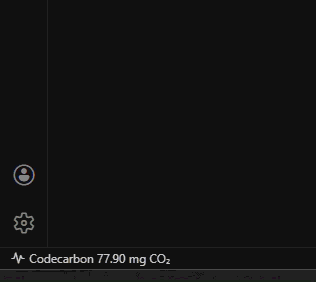
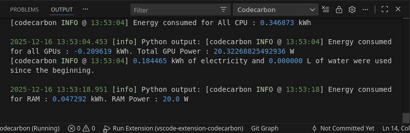

> :construction: **EARLY ACCESS**: This extension is in active development. We encourage everyone to try it out and provide feedback to help us improve. Your input is invaluable in making this tool better for everyone. Please share your thoughts, report bugs, and suggest features on our [GitHub Issues page](https://github.com/inimaz/vscode-extension-codecarbon/issues).

# Codecarbon extension

This extension allows you to track the carbon emissions of your code directly from your VsCode. It uses the [CodeCarbon](https://www.codecarbon.io/) package to estimate the carbon emissions of your code.

## Features

-   Track the carbon emissions of your code directly from your VsCode.
-   Start and stop the emissions tracking with a simple click.
    

-   View log in the output panel.

-   Save your emissions data into a csv file for further analysis.

## Requirements

The extension uses `codecarbon` to measure the carbon emissions. This package connects to your hardware via specific APIs to get to know the power usage of your CPU/GPU/RAM. These APIs depend on the brand and OS. See https://mlco2.github.io/codecarbon/methodology.html#power-usage for the needed tools for your specific setup.

> Note: if you do not install the requirements, codecarbon will track in fallback mode.

## Extension Settings

This extension contributes the following settings:

-   `codecarbon.launchOnStartup`: If true, the extension will start tracking the emissions when you open a new window. Defaults to true.

## Contributing

Some ideas on how to contribute to this extension:

1. **Testing**: You can help by testing the extension and reporting any issues you find.
1. **Feedback**: You can help by providing feedback on the extension. Feel free to open any issues or feature requests.
1. **Documentation**: You can help by improving the documentation.
1. **Code**: You can help by contributing code to the extension.

See [CONTRIBUTING.md](CONTRIBUTING.md) for more information..
